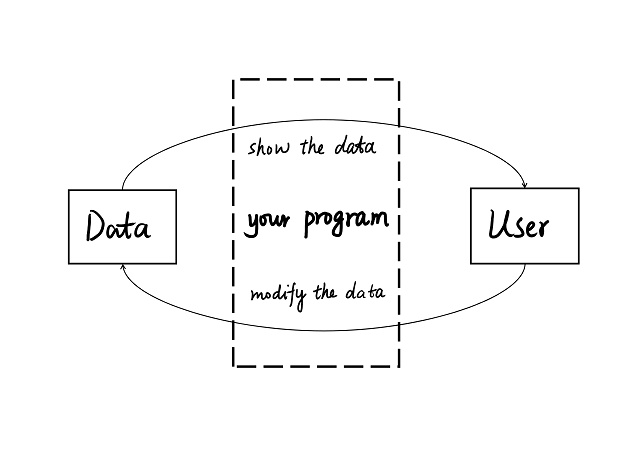

# Secret of Redux (1): automata

When I wandered on [Zhihu](https://www.zhihu.com)(Quora for Chinese) a few month ago,
An interesting question came into my view:

> What is Redux? Can anyone explain it in "human" Language?
> 
> _The question [here](https://www.zhihu.com/question/41312576),
> (in Chinese)_

Surely, it's hard to explain such a domain specialized tool like Redux clearly,
and avoid using tons of technical terminology.

However, two months have passed and __even no satisfactory technical answer appeared__.

The only acceptable piece is a translation work for [Redux and The Command Pattern](https://medium.com/@abhiaiyer/the-command-pattern-c51292e22ea7#.gml3ufwnf).
But unfortunately, the article stops with comparing Command Pattern and Redux.
The author didn't write about the idea behind Command Pattern, and why it works.

> You can you up. -- By some anonymous web users in China.
> 
> _(it means "stop criticising unless you can do better")_

Here in this article, I'll try to answer these questions:
* What kind of problems does Redux try to solve?
* What's the idea behind Redux?
* How it works?

__But it's beyond my ability to explain it non-technically.__

If you're expecting a non-technical explanation, 
maybe you can wait for my rewriting this article years later (not promised).
Though Redux might be out-of-fashion at that time,
I'm sure its philosophy will keep working in other tools.  

## My tank war homework

In my college years in NJU, 
my first programming homework was to develop a tank war game in Java.
(I don't want to call a 10-line Fibonacci calculator a homework)

It was damn nightmare for a freshman who. 
But I finally worked out a solution to display the game with Java SWT.

I designed the game merely in the following psuedo code:
```Java
class Tank {
  int x;
  int y;
  int speed;
  string direction;
  //...
}

class Bullet {
  int x;
  int y;
  int speed;
  string direction;
  
  //...
}

class Map {
  Array[][] matrix
  
  //...
}

class Game{
 List tanks;
 List bullets;
 Map map;
 //...
}
```

- Every 100 milliseconds, I recalculate all the tanks and bullets' position,
and draw them on the map.
- At the same time, it updates each tank's position and direction according to its category.
- Then 100 milliseconds later, I go back to step 1, to recalculate and repaint.

You may wonder why I mentioned that here.
My toy written in Java surely never used Redux
(the first line of Redux had  not ever been committed at that time).

__I mention it just for they do share something.__

Yes, a toy developed by a freshman years ago shares something with the one of the popular tool in web development today.
I don't mean Redux followed my idea(In fact, that's impossible).
I'm saying, __the idea behind Redux is really simple 
and even a freshman can understand.__

## Reconsider User Interface

What is UI?
User Interface is decides what we see and how we interact with a program.

That's right, but that's for human; 
For computers or for the program itself, what is it?

Is it composition of template and style files?
Is it just a bundle of render classes?
Or is it a composition of code snippets?

__Then, how about something mapping to the data?__

That is what Redux tells us:

* __What users can see is just transformed data;__
* __What they can do is just transformation on data__

This is the simplest way how a user interface should be implemented.
But after years of domination by OOP in this field,
new comers may easily lost themselves in the ocean of frameworks and patterns,
and forget the native of User Interface.

It is not about garish effects or mystifying philosophical idioms,
it is about bridging users and the data behind the program.



So let's look at the counter example :

(copied and modified from Redux's [git repo](https://github.com/reactjs/redux))
```JavaScript
import { createStore } from 'redux'

function counter(state = 0, action) {
  switch (action.type) {
  case 'INCREMENT':
    return state + 1
  case 'DECREMENT':
    return state - 1
  default:
    return state
  }
}

let store = createStore(counter)

store.subscribe(() =>
  let root = document.querySelector('#root')
  root.textContent = `current count: ${store.getState()}`
)

store.dispatch({ type: 'INCREMENT' })
// current count: 1
store.dispatch({ type: 'INCREMENT' })
// current count: 2
store.dispatch({ type: 'DECREMENT' })
// current count: 1
```

The code itself is not complex, 
while it's a little confusing for those who haven't used Redux.

Pay attention to this line: `store.subscribe(()=>...)`.
The callback function simulates a UI output. 
Each time the data you hold inside the `store` changes,
you'll get the message updated.

And for `store.dispatch`,
it will call the `counter` function with current `state` and the passed in action. 
The calculate result will replace the current `state` in our store.

The collection of data in Redux is called a "`state`". 
A `state` can be anything, and in this example, its a number initialized to 0.

We can see that, the `state` and the message has a _N to 1 mapping relation_
(N can any positive integer):
That is, whenever I know the `state`, I can calculate the message.

Here we can talk about the similarity between my tank war toy and Redux:

_They both hold a collection of all useful data, 
and then calculate the output from the data;
When a user inputs something, they update the data, and recalculate the output_

This "data => calculate output => modify data => recalculate" workflow is so simple and powerful that
it works for almost any program, not only for UI.

## No new thing under the sun: ver. automata
Automata theory plays an important role in computer science.
The famous Turing Machine might be the most well-known automata.

An automata can be described as states and transition.
- Say that we have an initial state `s0`
- And we have a valid input `a0`
- The automata accepts the input and applies the transition
- So we get `s1 = f(s0, a0)`

The description may be inaccurate. 
For a formal version, you need the help from a search engine or your old textbook.

Maybe you've noticed that,
it's quite similar with what Redux do with our data.
Or in other words, Redux simulates an automata when it works.

Let's see its core definitions:

- `state`: One of the states our program may hold; 
- `dispatcher`: the transition function, 
  it accepts the two params, the current state and the action
- `store`: A container that helps glue our `state` and `dispatcher`

The only difference is, the `store` of Redux is subscribable.
Thus developers can use it with their render functions easily be subscribe the `store`.

