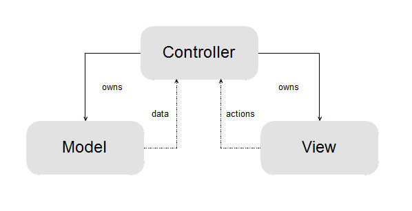
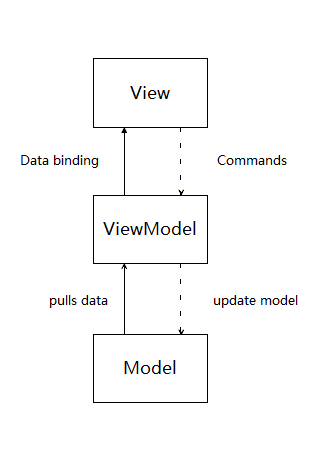

# Write a MVVM framework from scratch (1)

## TD;DR
Recently, I read several interesting post on zhihu, asking about MVVM.
With the rising of Angular and React, MVVM now is in the eye of the storm.

In this post and its successors, I'll explain how MVVM works and we'll write a toy MVVM framework.

The first post is a general introduction of MVVM and the problem it tries to solve.

__if you're a veteran, JUST SKIP THIS POST.__


## What is MVVM and Why it is different?

MVVM was born as a variant of MVC.
If you have already known MVC, MVVM is quite easy to understand.

You can roughly take it this way:
> MVVM is  MVC in adapter pattern.

All M-V-* patterns have one same aim, that is, 
providing an easy to understand pattern for organizing data-UI cooperation.

The differences lay on how they divide the code.

(_Attention: 10 developers may have 12 explanations of MVC, the following is totally my personal opinion._)

### Model-View-Controller and its potential problem

the Model-View-Controller pattern tries to separate UI(view) from Data-source(Model) directly 
while a controller would take care of user input. Below is how it works.


 
 
(The original svg file comes from 
[wikipedia](https://zh.wikipedia.org/wiki/MVC#/media/File:MVC-Process.svg).)
 
So here is a problem:

You should do adaptation in either the View layer or the Model layer 
(unless you are building a database visualization system :). 
But neither of them seems a proper candidate. 
Model is responsible for handling business logic (it is a 'model' of real world).
View focuses on displaying, so the data structure behind a view
is tightly coupled with how it will be displayed
(rather what will be displayed because that will make your view hard to reuse).
  
If you are not clear about what I'm talking above, let's see an example.

Say we have a data set of students info, stored in JSON files like:

```json
{
  "first-name": "Tracy",
  "last-name": "Kennedy",
  "grade": 6,
  "height": 150,
  "weight": 40
}
```

And we'll display it in a List view like:

```html
<ul>
  <li>
    <span>Name:</span>
    <span>Tracy Kennedy</span>
  </li>
  <li>
    <span>Grade:</span>
    <span>6</span>
  </li>
  <li>
    <span>Height:</span>
    <span>1.5m</span>
  </li>
  <li>
    <span>Weight:</span>
    <span>40kg</span>
  </li>
</ul>
```

Here are several problems:

1. We don't have a `name` field in the data set. So where should we calculate it?
2. Our `height` field is in centimeter, where should we transfer it to meters.
3. The most vexing one, who is responsible for extract the info into an array 
   as it is an object.
   
Any part of the program who tries to solve problems above will decrease greatly in reusability and maintainability.
It's easy to make a decision to use inheritance to make case specialised Model or View.
But...err, imaging that you have dozens of list-views in the a complex application.
You may have to document the inheritance tree.
That would be real world nightmare.

### Massive View-Controller

You may notice my intentional ignorance of the `Controller` layer.
Actually, in traditional MVC, a Controller is not a 'layer'. It is often shipped with a View.
View and Controller form the View-Controller layer of User Interaction.

But a Controller differs a little from view: _it is born polluted_.
I mean, a Controller is responsible for doing something adaptation or translation originally
(We use a Controller to translate user inputs to data changes).
It is originally coupled with View and Model and hard to reuse.

Yes, it sounds good to throw the dirty jobs to a Controller. So we slightly modify the MVC pattern:



Perfect, now we collect all dirty jobs in a single place.

__But__, you know I'll say 'but...', right?

Now you have another problem, 
You may result in wrapping thousands of lines in a single class,
making it hard to read and maintain.
And finally they call this variance a Massive View-Controller pattern,
since the monolithic controller is really long and complicated :)

I'm not criticising the attempt to isolate the adapter logic from both Model and View.
I'm saying that, it is a nice try, but could be nicer.

### ViewModel as adapter

To some degree, small is good in software industry.
People often talk about smaller classes, smaller function and components...
Because small often equals simple, and massive is often sign of complication. 

So the simplest way to avoid the complexity a monolithic controller brings us,
is to spare it into parts.

A monolithic controller has mainly three categories of logic
* UI effects, such as  page turning, scrolling...; 
* UI updates, as a result of Model changing;
* Commands, as a result of user operation;

UI effects are obviously different from the other two, it should go with the View layer.

What about UI updates, it should belong to something in the middle of the Model layer and View layer.

Ok, now we have broken the controller into at least two isolated parts.
How about Commands? Where should they go?

At this moment, it's a little hard to decide. We'll put it aside.

We'll see some sample code first:

Let's go on with the student info page, 
We'll borrow the template syntax from [Vue.js](https://vuejs.org)

```html
<ul>
  <li v-for="item in items">
    <span>{{item.description}}</span>
    <span>{{item.content}}</span>
  </li>
</ul>
```
The lines above means we'll iterate through a list called `items`.
For each item in it, we'll insert a `<li>` tag and fill the `<span>` with its properties.

So if we may need a transfer function:

```javascript
function items(student){
  function item(description, content){
    return {
      description: description,
      content: content
    }
  }
  
  let result = []
  result.push(
    new item('Name', `${student['first-name']} ${student['last-name']}`))
  result.push(new item('Grade', student['grade']))
  result.push(new item('Height', `${student['height'] * 0.01}m`))
  result.push(new item('Weight', `${student['weight']}kg`))
}
```
The function `items` is not reusable. 
But we freed our list-view, it's now decoupled from the business logic.
 
If you can understand the above example, now you know how M-V-VM works.


The data function is a View-Model in our example. 
It turns the data from model into a special structure the View can accept.

Then we'll see the issue we skipped just now:

_Who is responsible for handling commands?_

Say that, we'll add buttons to tell the system if a student's info is valid:

```html
<ul>
  <li v-for="item in items">
    <span>{{item.description}}</span>
    <span>{{item.content}}</span>
  </li>
</ul>
<button onclick="{{confirm}}">confirm</button>
<button onclick="{{reject}}">reject</button>
```

Who should implement `confirm` and `reject` function?

The View invokes them, but a View should be business-free.
I think we should not hesitate to push them into the View-Model layer.
The View-Model acts as an adapter, so why not make it a two-way adapter?

So the M-V-VM pattern is something like this:



_Notice_ that some M-V-VM frameworks provide two-way data-binding (WPF, knockout.js...),
I think it really doesn't matter if you use two-way or one-way binding.
The important thing is, View interacts with Model via an adapter layer.
It is your personal preference how to bind the View and View-Model.
For me, one-way binding with commands is my favorite.