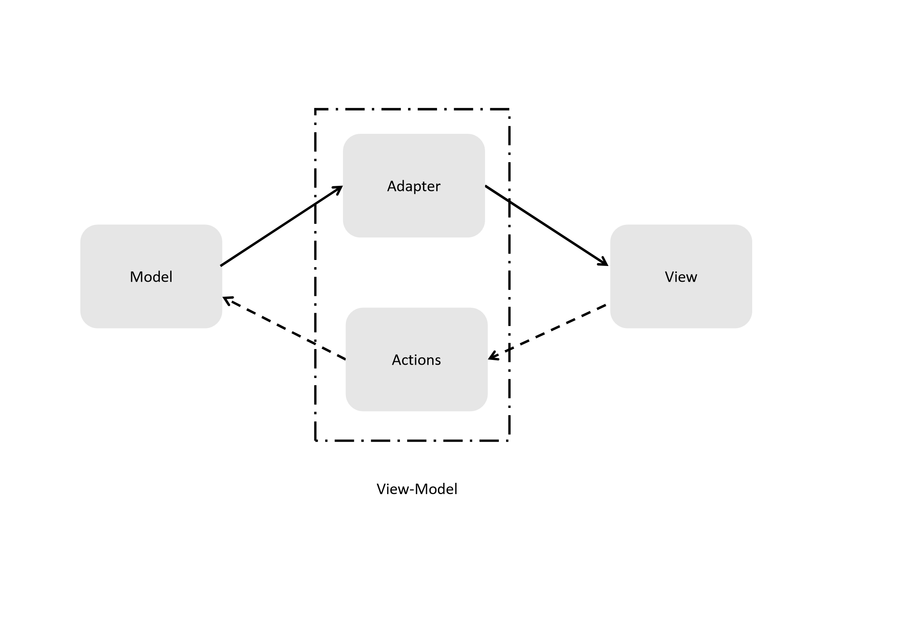

# Write a MVVM framework from scratch (3)

last post, we made a app to display student info and refactored it to mvvm-style.

I didn't say it, but maybe you have already noticed,
we have already made something looks like a mvvm framework at the end.

If you forgot the last post or you skipped it, don't worry, here's the code (and I add some comments):

```JavaScript
/**
* @param {Node} root
* @param {Object} model
* @param {Function} view
* @param {Function} vm
*/
const run = function (root, {model, view, vm}) {
  let m = {...model}
  let m_old = {}

  setInterval( function (){
    if(!_.isEqual(m, m_old)){
      const rendered = view(vm(m))
      root.innerHTML = ''
      root.appendChild(rendered)

      m_old = {...m}
    }
  },1000)
}
```

Hey, are you kidding?
A framework in 10 lines?

__A framework is an abstraction of how code should be organized and how the whole program should work in general.__

It doesn't mean you should have a bunch of code or mess of classes.
Though enterprise usable frameworks' API lists are often scary long.

But if you look up the core folder of a framework's repo,
you'll probably find it surprisingly small (compared to the whole project).

The core holds its working procedure, and the other parts,
maybe we can call them peripherals,
helps developers build their app in a more comfortable way.
An example of how small a framework could be is [cycle.js](http://cycle.js.org/), with only 124 lines
(comments and spaces included).

I strongly recommend you to watch Andre André Staltz's [videos](https://egghead.io/series/cycle-js-fundamentals) describing Cycle.js.
The videos displayed the whole process of how a framework is worked out (and made me feel like re-inventing wheels here after watching them).

## Abstract your framework

### Generics hunting

We say a framework provides the generic procedure of how the whole program works.

This description is ambiguous and makes no sense.
If I know what is generic in my program,
programming will be at least ten times easier.

Frameworks are something hinting developers of what might be generic and easily reused.
They provides a not-too-bad code template for certain categories of  problems.
That's why I pay full respect to those who built widely used frameworks.
They took the hard parts and leave us the easy way.

How about our student info App?
We refactored it into mvvm style, so what are the generic parts?
Luckily, we've already known mvvm and how it works:



Our App mainly consists of four parts, and the framework should bond them together.
It defines interfaces and maintains the data flow.

It is something like DIY a personal PC.
You have CPU, memory, hard drive and other components.
And you have a motherboard with some slots.
Your custom code works like components, and the framework is the motherboard.
You only need to care whether components have required interfaces.
How they are put together? Who cares? Motherboard will  do it.

According from the graph, our framework will form a circle of data flow:
1. Data starts from Model via Adapter and finally displayed on View;
2. User interacts start from View, via actions and finally change the Model;
3. Then data goes from the modified Model and repeat step 1;

_Actually, frameworks varies on how they work.
They share some feature on interfaces rather than how they are implemented._

### Details: Choosing toolkits for View

From this section, we'll see some details in making a framework.
There may be vast of concerns, but we'll focus on several points I consider important.

__The trade-off we'll make are mainly based on my own experience and may not fit you readers.
I'm not persuading you.
It is just an exhibition  of technics that I know with some personal comments.__

The first and most important concern may be the interfaces of View.
This issue affects developers' user experience a lot.
If a UI framework can't provide a good experience with UI creation, it's really depressing.

Most widely used technic for View creation in Web development is using a template DSL.
Many famous solutions adopt it. For example, Angular and React.
And before SPA got popular, template is already widely used.
The best program language we ever know :), PHP,
is designed for generating html from template  server side at first.

Template is popular mainly for its high readability and acceptable reusability.

To see it, let's review some code from earlier posts.

Take 10 seconds to understand following code segment:
```JavaScript
const createList = function(kvPairs){
  const createListItem = function (label, content) {
    const labelSpan = document.createElement('span')
    labelSpan.textContent = label

    const contentSpan = document.createElement('span')
    contentSpan.textContent = content

    const li = document.createElement('li')
    li.appendChild(labelSpan)
    li.appendChild(contentSpan)

    return li
  }

  const root = document.createElement('ul')
  kvPairs.forEach(function (x) {
    root.appendChild(createListItem(x.key, x.value))
  })
  return root
}
```

Now time up, I can bet that most of you feel confused.
Though its code style is actually not bad.
It is really not your or my fault.
Describing a HTML fragment with JavaScript DOM APIs is something not that...err, straight?

We first read the code,
and then in our brain, do manual compiling and running to get HTML code.
After that, we need to manually compile the HTML code into a Web page to know what it would actually produce.

But with template, we need only one step of manual compile: HTML -> Web page.
```html
<ul>
  @foreach(var x in kvPairs)
  {
     <li>
       <span>@x.key</span>
       <span>@x.value</span>
     </li>
  }
</ul>
```

Obviously, most of you can understand it in a few seconds.
You don't even need to know what language I'm using. (Razor for ASP.NET)

Template is coooooooool for users, 
but not that cool for framework developers.
Using template DSL often means 
you need to ship your framework with a template engine.
In most cases, a template engine would take tolerable but painful space.
For example, the famous template DSL, jade.js, takes more 46kb in minimal format.

A framework specialized template engine or compiler is much smaller.
But it requires extra efforts to maintain the compiler.

After all, I personally consider template the best solution.
But we won't use it in our toy framework.
I want something that could be implemented easier 
while its readability is still acceptable.

If you have heard about [Elm.js](http://elm-lang.org/),
you may have noticed its special way of creating DOM view.
```haskell
main =
  span [class "welcome-message"] [text "Hello, World!"]
```

Above is how to create a Hello world page with Elm. 
Elm borrowed most of its language specs from Haskell.
If you don't know Haskell, that's OK.
I'll translate it into JavaScript:

```JavaScript
const main = function () {
  const attrs = [class('welcome-message')]
  //class is a function return a Node attribute of class name
  const children = [text('Hello World!')]
  //text is a function returns a text Node
  
  return span(attrs, children)
  //span is a function returns a span Node
}
```

It looks a little confusing, 
though much better than the original version of `Document.createElement` C&P.
And it's much easier to implement.
`span`,`class`,`text` are all JS functions.
You don't need to know anything about compiler or parser or something similar.

I think this solution is acceptable as compromise (Maybe not for you : ). 

So I'll introduce [HyperScript](https://github.com/dominictarr/hyperscript)
and a [helper](https://github.com/ohanhi/hyperscript-helpers) lib for it.
With these libs, we can easily create a list-view this way:

```JavaScript
const createList = function (kvPairs) {
  const listItem = function ({key, value) {
    return li({}, 
              [span({},[text(x.key)]), 
               span({},[text(x.value)])
              ])
  }
  
  return ul({}, kvPairs.map(listItem))
}
```
Though HyperScript-helpers supports various of APIs. 
We can simply use two rules:
```Javascript
/**
* @param {String} selector - The query String like '.class', '#id'
* @param {Object} attributes - The Node Attributes dict
* @param {Array} children - The list of children nodes.
*/
TagName(selector, attributs, children)
TagName(attributes, children)
```

### Details: How to repaint?

Another reason for HyperScript is for better repainting support.

The oldest solution for updating the web page is refreshing.
At that time, repainting means getting data from the sever one more time.  
Then came Ajax. 
With Ajax, we are able to control which part of the page should be repainted.

But managing a DOM whole complicated DOM tree is not easy. 
Developers have to balance between running efficiency and developing efficiency.

Take our student info App as an example. 
We repaint the whole tree each time the Model changes.
Obviously that's not necessary: 
No matter how the Model changes, 
the structure of the list-view and the Label spans stay the same.

For a hello-world level demo, it matters little how you make it.
But for industrial projects, performance is important.

Model Web frameworks have tried to solve this problem for years.
By parsing the template and collect dependencies, 
many frameworks are able to control each Node accurately.

Among all the efforts made by pioneers of web developers.
Virtual DOM introduced by Facebook, is the most widely accepted solution.

The idea behind virtual DOM is not new. 
Java developers have been using buffer for string building for decades.
With virtual DOM:
1. We edit the virtual DOM tree (vtree), nothing happens to the "real" tree now;
2. We finished editing, and diff vtree from its older version;
3. We patch the diff results;
4. Virtual DOM do some optimisation on our patch and update the "real" tree;

So no matter how many times we edit the vtree,
we only update the "real" tree one time.
It saves a lot comparing to `$(selector).attr(name, value)`, 
which would repaint the page several times.

```Javascript
const render = function (root, left, right) {
  patch(root, diff(left, right))
}
```
Above is a Hello-world level example for virtual dom APIs.
But that's enough for our toy framework.

### Details: When to repaint?

_Or in other words, how can I know if I need to repaint?_

In the original work, we use polling.

Polling is easy to implement. 
The performance is acceptable for our student info App.
One loop per second is OK for modern CPUs.
But if you need the view to update more frequently,
or you need to support some really old machine.
Polling in the browser may not be a good idea.

Fortunately, pioneers of OOP have already invented some mutual technics.
When faced with such kind of problem:
> How can I notify one part of the system the state of another part has changed?

We often use an Observer Pattern. 
Observer Pattern is so widely used 
that every front-end developer has already used it even they never heard of it.

Yes, when you write `node.addEventListener(myFunc)`,
you're enjoying the convenience of Observer Pattern.
And the callback hell you suffer every day,
can be viewed as a special kind of Observer Pattern.

The core idea for Observer Pattern is to separate "WHEN" and "WHAT".
The Observable, which is observed knows "WHEN" something should happen;
While the Observer (or subscriber), knows "WHAT" will happen.

Talking about concepts is cheap, let's see some code:
```JavaScript
let observable = {
  _observers: [],
  notify: function() {
    this._observers.forEach(function(wather){
      watcher.onNotify()
    })
  }
}

let observer = {
  onNotify: function() {/*custom code*/}
} 

const observe = function(observer, observable) {
  if(!observable._observers.contains(observer)){
    observable._observers.push(observer)
  }
}
```

Once you add an observer to the subscriber list of an observable,
the `onNotify()` method will be immediately called 
when the observable notifies a change. 

As you can see, there is no difference from a direct function call,
except the function to call is not hard coded.

If the Model is observable, we can observe them and update on changing.
That is exactly how most frameworks handle it.

Knockout.js is one of the first generation MVVM toolkits.
To use Knockout, you need to make your data a Knockout obersevable:
```Javascript
const model = function (data) {
  this.firstName = ko.obersevable(data.firstName)
}
```


Many may think doing boxing manually is awful repeating job.
So they hacked the Model with es5 `Object.defineProperty` API.

Let's see how to do it:
```JavaScript
const notifyPropertyChange = function (prop) {
  /*your notifying logic here*/
}

const hack = function(obj) {
  const keys = Object.keys(obj).filter(obj.hasOwnProperty)
  keys.forEach(fucntion(key) {
    let value = obj[key]
    Object.defineProperty(obj, key, {
      set: function(newVal) {
        value = newVal
        notifyPropertyChange(key)
      },
      get: () => value,
      writable: true,
      configurable: true
    })
  })
}
```

Vue.js shortcuts the observing procedure with this technic.
When creating a Vue component,
the framework will hack the `data` and `computed` field automatically.

While Cycle.js far more radical.
Cycle bases its Observer system totally on Rx.js.

Let's see some example:
```Javascript
import Cycle from '@cycle/core';
import {div, label, input, hr, h1, makeDOMDriver} from '@cycle/dom';

function main(sources) {
  const sinks = {
    DOM: sources.DOM.select('.field').events('input')
      .map(ev => ev.target.value)
      .startWith('')
      .map(name =>
        div([
          label('Name:'),
          input('.field', {attributes: {type: 'text'}}),
          hr(),
          h1('Hello ' + name),
        ])
      )
  };
  return sinks;
}

Cycle.run(main, { DOM: makeDOMDriver('#app-container') });
```
I copied this example from Cycle's [homepage](http://cycle.js.org).
You can see it's quite different from frameworks we are familiar with.
The philosophy behind Cycle is quite interesting,
you will know more if you visit their official site.

As for me, to make our toy framework small, 
I'd choose the manual way.
(This is also the earliest solution used in .Net WPF) 
It is easy to implement and leaves more control to the user.
The cost is more boilerplate code.

### The final work

Let's see what our toy would look like,
It is much simpler than I first thought:

```Javascript
import {h, patch, diff, create} from 'virtual-dom'

const render = function (root, left, right) {
  patch(root, diff(left, right))
}

/**
* @param {Object} model
* @param {Function} view - takes one param, viewmodel
* @param {Function} viewModel - takes two params, model and notify
*/
export default function run (rootSelector, {model, view, viewModel}) {
  let left = h('div')
  let right
  let root = create(left)
  
  const notify = function notify () {
    left = right
    right = view(viewModel(model, notify))
    render(root, left, right)
  }
  
  document.querySelector(rootSelector).appendChild(root)
  
  right = view(viewModel(model, notify))
  render(root, left, right)
}
```

27 lines in total, with comments. Amazing, right?
And I wrote a small hello world demo 
which looks like the one you'll see on Angular.js [homepage](https://angularjs.org/#the-basics).

```Javascript
import helper from 'hyperscript-helpers'
import {h} from 'virtual-dom'

import run from '../src/index'

const {div, label, input, hr, h1} = helper(h)

let model = {
  tpml: (x) => `hello ${x} !`,
  name: ''
}

const viewModel = function (model, notify) {
  return {
    msg: model.tpml(model.name),
    name: model.name,
    oninput: function (ev) {
      model.name = ev.target.value
      notify()
    }
  }
}

const view = function (vm) {
  return div({},
             [label({textContent: 'Name: '}, []),
              input({type: 'text', value: vm.name, oninput: vm.oninput}, []),
              hr({}, []),
              h1({textContent: vm.msg}, [])
             ])
}

run('#app', {model, view, viewModel})

```

You can download the source and the example [here](https://github.com/Twiknight/mvvm-toy).
Feel free to play with it.

### A few words

You may feel uncomfortable with my implementation.
Especially, many may dislike the `notify()` function.
```javascript
  const notify = function notify () {
    left = right
    right = view(viewModel(model, notify))
    render(root, left, right)
  }
```

Actually, recursion here is not necessary at all.
You can use a proxy instead.
```javascript
//Pseudo code
const proxy = {
  notify: function () {
    this.renderers.forEach(func => func())
  },
  renderers: []
}

proxy.renderers.push(function(){
  left = right
  right = view(viewModel(model,proxy.notify)
  render(root, left, right)
})

proxy.notify()
```

It's all about personal preferrences.
