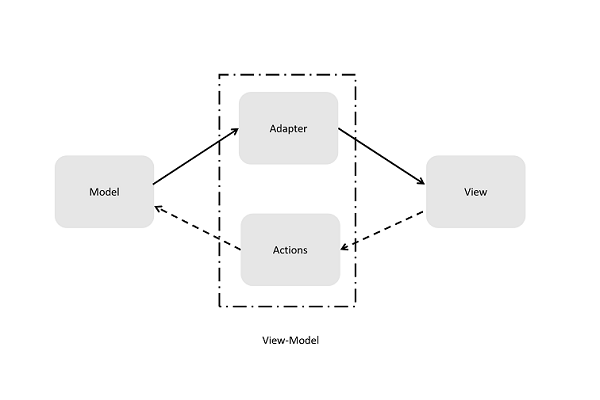

# Write a MVVM framework from scratch (3)

last post, we made a app to display student info and refactored it to mvvm-style.

I didn't say it, but maybe you have already noticed,
we have already made something looks like a mvvm framework at the end.

If you forgot the last post or you skipped it, don't worry, here's the code (and I add some comments):

```JavaScript
/**
* @param {Node} root
* @param {Object} model
* @param {Function} view
* @param {Function} vm
*/
const run = function (root, {model, view, vm}) {
  let m = {...model}
  let m_old = {}

  setInterval( function (){
    if(!_.isEqual(m, m_old)){
      const rendered = view(vm(m))
      root.innerHTML = ''
      root.appendChild(rendered)

      m_old = {...m}
    }
  },1000)
}
```

Hey, are you kidding?
A framework in 10 lines?

__A framework is an abstraction of how code should be organized and how the whole program should work in general.__

It doesn't mean you should have a bunch of code or mess of classes.
Though enterprise usable frameworks' API lists are often scary long.

But if you look up the core folder of a framework's repo,
you'll probably find it surprisingly small (compared to the whole project).

The core holds its working procedure, and the other parts,
maybe we can call them peripherals,
helps developers build their app in a more comfortable way.
An example of how small a framework could be is [cycle.js](http://cycle.js.org/), with only 124 lines
(comments and spaces included).

I strongly recommend you to watch Andre André Staltz's [videos](https://egghead.io/series/cycle-js-fundamentals) describing Cycle.js.
The videos displayed the whole process of how a framework is worked out (and made me feel like re-inventing wheels here after watching them).

## Abstract your framework

### Generics hunting

We say a framework provides the generic procedure of how the whole program works.

This description is ambiguous and makes no sense.
If I know what is generic in my program,
programming will be at least ten times easier.

Frameworks are something hinting developers of what might be generic and easily reused.
They provides a not-too-bad code template for certain categories of  problems.
That's why I pay full respect to those who built widely used frameworks.
They took the hard parts and leave us the easy way.

How about our student info App?
We refactored it into mvvm style, so what are the generic parts?
Luckily, we've already known mvvm and how it works:



Our App mainly consists of four parts, and the framework should bond them together.
It defines interfaces and maintains the data flow.

It is something like DIY a personal PC.
You have CPU, memory, hard drive and other components.
And you have a motherboard with some slots.
Your custom code works like components, and the framework is the motherboard.
You only need to care whether components have required interfaces.
How they are put together? Who cares? Motherboard will  do it.

According from the graph, our framework will form a circle of data flow:
1. Data starts from Model via Adapter and finally displayed on View;
2. User interacts start from View, via actions and finally change the Model;
3. Then data goes from the modified Model and repeat step 1;

_Actually, frameworks varies on how they work.
They share some feature on interfaces rather than how they are implemented._

### Details: Choosing toolkits for View

From this section, we'll see some details in making a framework.
There may be vast of concerns, but we'll focus on several points I consider important.

__The trade-off we'll make are mainly based on my own experience and may not fit you readers.
I'm not persuading you.
It is just an exhibition  of technics that I know with some personal comments.__

The first and most important concern may be the interfaces of View.
This issue affects developers' user experience a lot.
If a UI framework can't provide a good experience with UI creation, it's really depressing.

Most widely used technic for View creation in Web development is using a template DSL.
Many famous solutions adopt it. For example, Angular and React.
And before SPA got popular, template is already widely used.
The best program language we ever know :), PHP,
is designed for generating html from template  server side at first.

Template is popular mainly for its high readability and acceptable reusability.

To see it, let's review some code from earlier posts.

Take 10 seconds to understand following code segment:
```JavaScript
const createList = function(kvPairs){
  const createListItem = function (label, content) {
    const labelSpan = document.createElement('span')
    labelSpan.textContent = label

    const contentSpan = document.createElement('span')
    contentSpan.textContent = content

    const li = document.createElement('li')
    li.appendChild(labelSpan)
    li.appendChild(contentSpan)

    return li
  }

  const root = document.createElement('ul')
  kvPairs.forEach(function (x) {
    root.appendChild(createListItem(x.key, x.value))
  })
  return root
}
```

Now time up, I can bet that most of you feel confused.
Though its code style is actually not bad.
It is really not your or my fault.
Describing a HTML fragment with JavaScript DOM APIs is something not that...err, straight?

We first read the code,
and then in our brain, do manual compiling and running to get HTML code.
After that, we need to manually compile the HTML code into a Web page to know what it would actually produce.

But with template, we need only one step of manual compile: HTML -> Web page.
```html
<ul>
  @foreach(var x in kvPairs)
  {
     <li>
       <span>@x.key</span>
       <span>@x.value</span>
     </li>
  }
</ul>
```

Obviously, most of you can understand it in a few seconds.
You don't even need to know what language I'm using. (Razor for ASP.NET)

Template is coooooooool for users, 
but not that cool for framework developers.
Using template DSL often means 
you need to ship your framework with a template engine.
In most cases, a template engine would take tolerable but painful space.
For example, the famous template DSL, jade.js, takes more 46kb in minimal format.

A framework specialized template engine or compiler is much smaller.
But it requires extra efforts to maintain the compiler.

After all, I personally consider template the best solution.
But we won't use it in our toy framework.